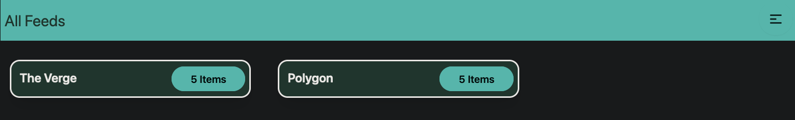
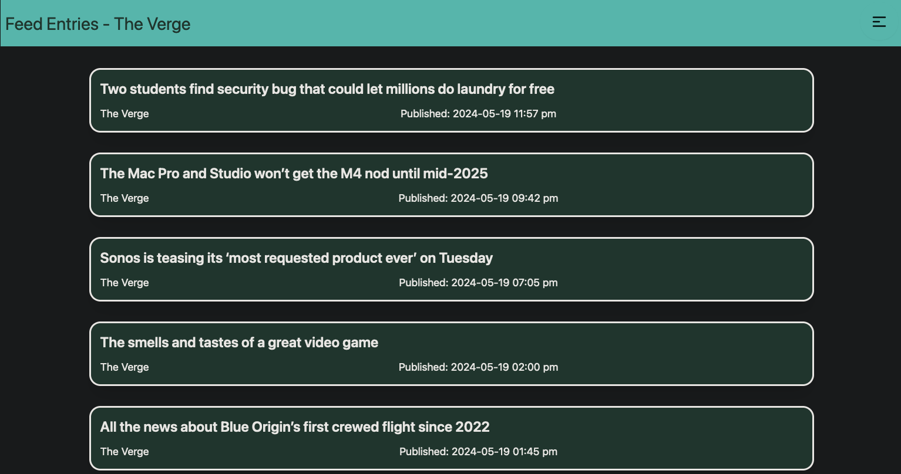
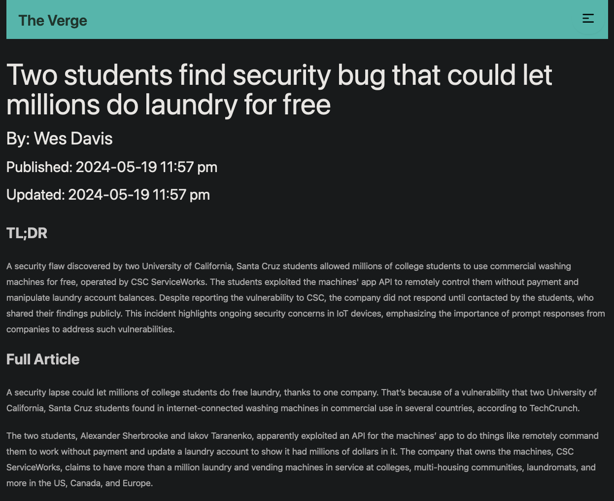
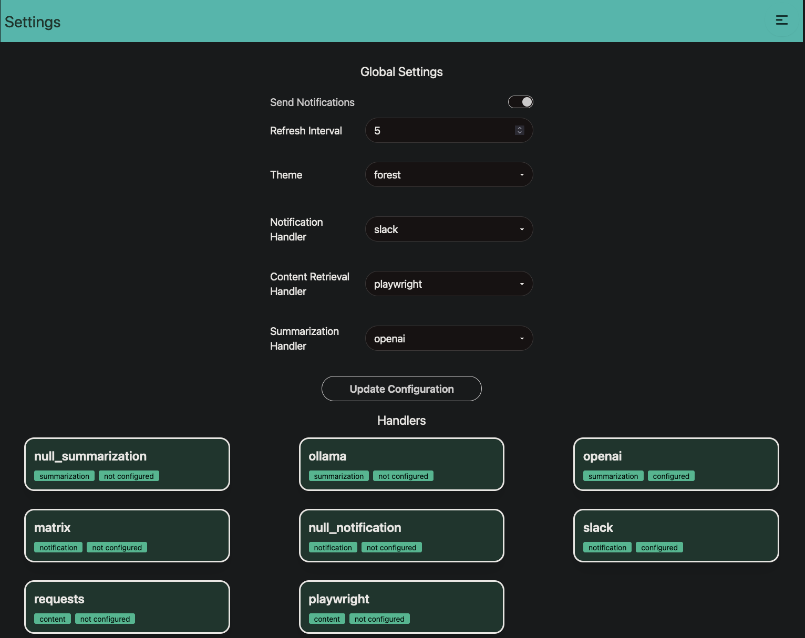
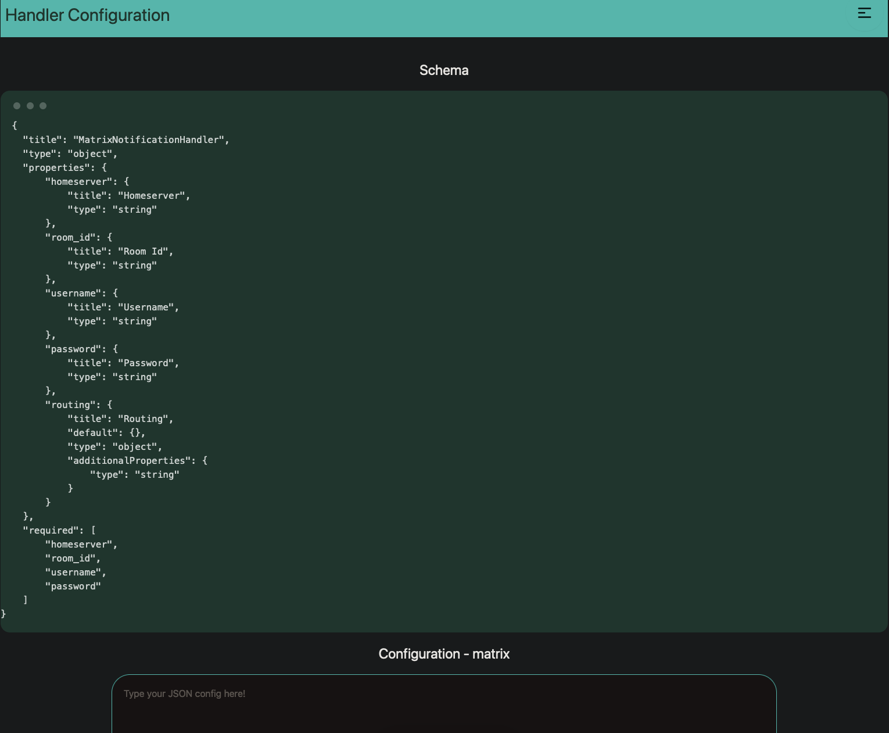

--
Precis (properly Précis, pronounced "pray-see") is a extensibility-oriented RSS reader that can use LLMs to summarize and synthesize information from numerous different sources, with an emphasis on timely delivery of information via notifications.

The following components of the app are extensible:
1. Summarization - LLMs including Ollama and OpenAI
2. Content Retrieval - `requests` or `playwright`
3. Notification - currently - `matrix` or `slack`, but support for other protocols such as `discord` or `mattermost`, or push-based services such as `gotify` or `ntfy`, or even a message bus such as `kafka`.
4. Storage - At this time, we support two reasonable embedded DBs - `tinydb` or `lmdb` - defaults to `tinydb`. You can add support for your database of choice if you can implement about 20 shared transactions.

The Summarization and Notification handlers also support a `null` handler that does nothing. Good for testing or if you don't care about notifications and summaries. The null handler is the default.

Precis also supports themes.

For an extended overview of why this project exists, see [my blog](https://www.leozqin.me/posts/precis-an-ai-enabled-rss-reader/)

## Architecture
Precis is a FastAPI monolith that serves fully static pages styled by Tailwind CSS using DaisyUI components. It uses some query-parameter and redirect chicanery to fake interactivity. We'll probably add actual interactivity at some point.

## Deployment via Docker-Compose:
If you want to run via docker-compose:
```bash
docker compose up
```
Feel free to edit the [docker-compose.yml](docker-compose.yml) as needed to fit your environment.

## Pre-Requisites
- Python 3.11 (for dev, we recommend you use pyenv)
- Node 20 or higher (use nvm)

## Development Instructions
To install, create a fresh venv and then:
```bash
make dev
```
Then to develop, in one terminal start tailwind by doing `make tw`. Then, in other start the main app by doing `make run`.

## UI Tour
After initial onboarding, you'll be brought to the feeds page.


You can then view the feed entries for each feed.


When you read a feed entry you'll get the full text of the article, as well a summary if you have a summarization handler configured.


Global settings can be configured in the UI


Configuring individual handlers is as simple as following an JSON Schema spec. (At some point we'll make a real UI)

