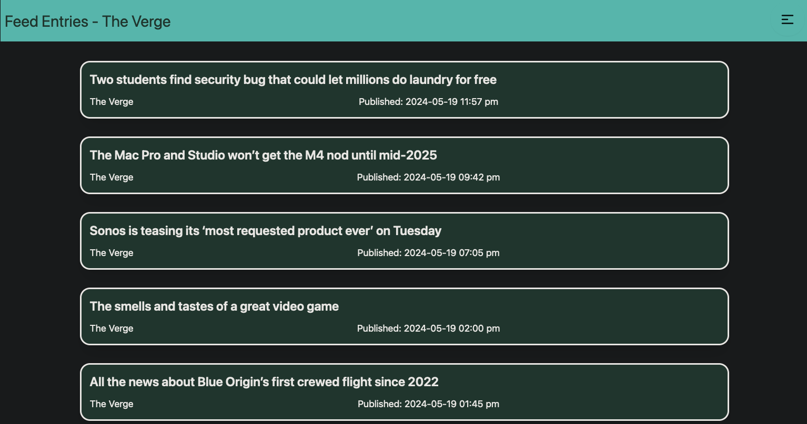
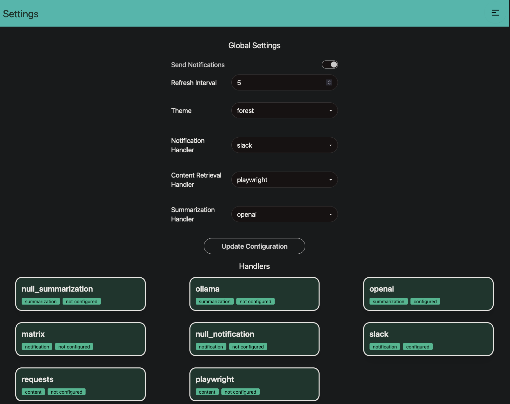

--
Precis (properly Précis, pronounced "pray-see") is a extensibility-oriented RSS reader that can use LLMs to summarize and synthesize information from numerous different sources, with an emphasis on timely delivery of information via notifications.

The following components of the app are extensible:
1. Summarization - LLMs including Ollama and OpenAI
2. Content Retrieval - `requests` or `playwright`
3. Notification - `matrix`, `slack`, `jira`, and `ntfy`
4. Storage - At this time, we support two reasonable embedded DBs - `tinydb` or `lmdb` - defaults to `tinydb`. You can add support for your database of choice if you can implement about 20 shared transactions.

The Summarization and Notification handlers also support a `null` handler that does nothing. Good for testing or if you don't care about notifications and summaries. The null handler is the default.

Precis also supports themes.

For an extended overview of why this project exists, see [my blog](https://www.leozqin.me/posts/precis-an-ai-enabled-rss-reader/).

## Architecture
Precis is a FastAPI monolith that serves fully static pages styled by Tailwind CSS using DaisyUI components. It uses some query-parameter and redirect chicanery to fake interactivity. We'll probably add actual interactivity at some point.

# Deployment and Development
## Environment
Precis uses the following environment variables to define its instance. It is, therefore, possible to have multiple instances of Precis running at the same time, as long as you maintain separation between their storage and config directories.

These are expected to be set as environment variables.
```
CONFIG_DIR - the directory where config files live, if you use them
DATA_DIR - the directory where the database should live
RSS_BASE_URL - the base url (without trailing slash of the Precis application - used for linking)
PRECIS_STORAGE_HANDLER - the name of the storage handler to use.
```

Different features may require different environment variables. Developers should strive to set reasonable defaults and document the full range of them in the [docker-compose.yml](docker-compose.yml)

## Deployment via Docker-Compose:
The easiest way to run Precis is via docker-compose:
```bash
docker compose up
```
Feel free to edit the [docker-compose.yml](docker-compose.yml) as needed to fit your environment.

## Pre-Requisites
- Python 3.11 (for dev, we recommend you use pyenv)
- Node 20 or higher (use nvm)

## Development Instructions
### Application
To install the RSS application, create a fresh venv and then:
```bash
make dev
```
Then to develop, in one terminal start tailwind by doing `make tw`. Then, in other start the main app by doing `make run`.

### Integration Tests
Precis has integration tests that are written in Go. They are automated to run during the pull request pipeline, but they also be run locally.

First, install the version of Go specified in `go.mod`. I recommend to use a Golang version manager such as `gvm` or `g`.

Then, start the application using `make run`. Finally, run the integration tests with `make test`.

# Features
## OPML Import/Export
Precis supports exporting your current set of feeds as OPML, as well as importing feeds from other OPML files. You can find options on the `/feeds/` page, or use the CLI as described below.

A couple caveats:
1. When importing an OPML file, if the feed already exists then it will be upserted. Any properties that differ from the OPML file will change to match.
2. When importing an OPML file, Precis will take the first category as the category of the feed. You may always change the category at a later time.
3. When importing and exporting, we the map the feed name, feed url, and category to the outline item `text`, `xml_url`, and `categories[0]` attributes, respectively. Please ensure that your input file uses the same conventions.

## Backups
Precis supports exporting and importing point-in-time backups of the entire application state. You can find these options on the `/about/` page, or use the CLI as described below. One of the design goals of this functionality is supporting the ability to combine two different Precis instances, so the default behavior of the import functionality is to upsert.

Users should be careful about potentially importing the same backup twice, and importing backups that have overlapping content may cause unexpected behavior.

Finally - the backups will contain any API keys or other secrets that you've configured Precis to use, so they should themselves be treated as secrets.

## Composable Configurations
Precis supports reading configurations from YML files that are stored in the `CONFIG_DIR` as an alternative to manually configuring them in the UI. This lets you bootstrap your configuration and/or manage configurations in source control. Of course, even if you use composable configurations, you can still add additional feeds or change settings in the UI.

Composable configurations can be used to configure feeds, settings, and handlers, and each of these can be ingested from the source file using the cli. Below are links to the example configs off of which you can base your own, as well as the command to import those configurations in the CLI.

- [Settings](configs/settings.yml.example) are configured in `${DATA_DIR}/settings.yml` and imported using `precis load-settings`
- [Handlers](configs/handlers.yml.example) are configured in `${DATA_DIR}/handlers.yml` and imported using `precis load-handlers`
- [Feeds](configs/feeds.yml.example) are configured in `${DATA_DIR}/feeds.yml` and imported using `precis load-feeds`

## CLI
Precis includes a CLI tool that can be used to manage the application. Currently, it supports exporting and importing JSON backups and OPML files and loading Composable Configurations (as described above). It should be available if you start a shell in the docker container, or if you activate the virtualenv where Precis is installed. It respects the `DATA_DIR` and `CONFIG_DIR` that you configured, if any.

```bash
❯ precis --help
Usage: precis [OPTIONS] COMMAND [ARGS]...

Options:
  --help  Show this message and exit.

Commands:
  backup         Write a json-format backup of the current Precis state...
  check-feeds    Check for new entries in the configured feeds
  export-opml    Write a opml-format list of the feeds configured in...
  import-opml    Import an opml-formatted feed list into Precis
  load-feeds     Load feeds from a YML-formatted feeds.yml file in the...
  load-handlers  Load global handlers from a YML-formatted handlers.yml...
  load-settings  Load global settings from a YML-formatted settings.yml...
  restore        Restore a json-format backup of the Precis state
```

## UI Tour
After initial onboarding, you'll be brought to the feeds page.


You can then view the feed entries for each feed.


When you read a feed entry you'll get the full text of the article, as well a summary if you have a summarization handler configured.


Global settings can be configured in the UI


Configuring individual handlers is as simple as following an JSON Schema spec. (At some point we'll make a real UI)

